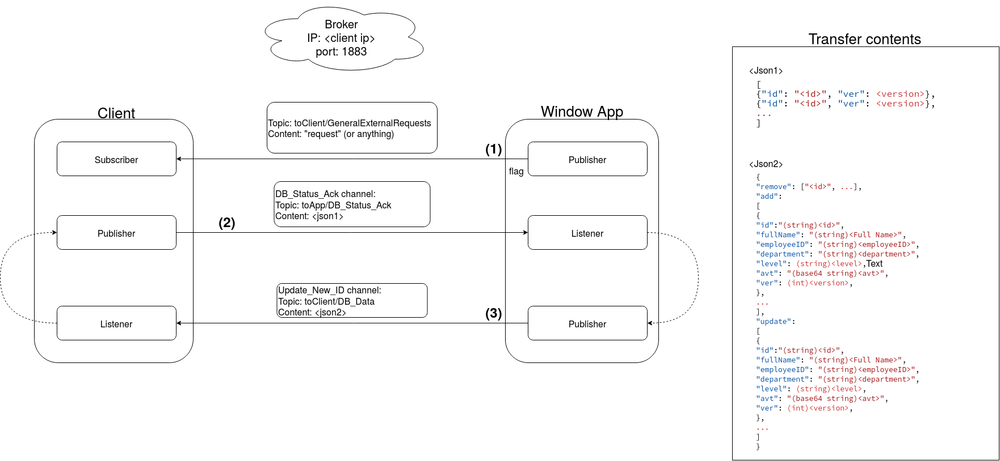

# Update Database Sqlite for GUI

## Yêu cầu

- Chạy với broker localhost
- Cấu trúc json add, remove, Update
- Dùng thư viện của qt

- Lựa chọn checksum để kiểm tra tính toàn vẹn thông tin.

## Project architecture

Chương trình được viết bằng Qt console, sử dụng các thư viện của Qt như QMqtt, QJson, QSql...


### main.cpp

### MqttClientUpdate

- Subscribe to topic: `toClient/#`
  - If topic == `toClient/GeneralExternalRequests`: export ID, version list as json then publish to topic: `toApp/DB_Status_Ack`.
  - If topic == `toClient/DB_Data`: update Database (add, remove, update), then export ID, version list and publish again.

- Init, open and close database

### SQLiteDB

- setDBPath, setDBTable
- initDatabase connection, openDatabase, closeDatabase
- insertPerson: insert employee infomation to Database
- removePerson: remove employee infomation from database
- updateInfo: update employee infomation
- checkDuplicate: check employee infomation do exist in database before add it to Database

- exportIDs: expost json that include: ID-ver and return as QJsonDocument


## Protocol

Kiến trúc giao tiếp với App window



Cơ chế hoạt động như sau:

- Mqtt client subscribe vào topic: `toClient/#` (nhận mọi topic có đầu là `toClient/...`)
  - Nếu nhận từ topic: `toClient/GeneralExternalRequests` thì gọi mở Database connection, gọi hàm xuất ID-ver từ cơ sở dữ liệu hiện tại dưới dạng json theo format `<json1>`, đóng database connection. Sau đó publish vào topic `toApp/DB_Data` để Winform App so khớp.
  - Sau khi so khớp xong, Winform App sẽ publish thông tin update database bao gồm: thêm, sửa, xóa dưới dạng json theo định dạng `<json2>` tới topic `toClient/DB_Data`.
  - Nếu mqtt client nhận được msg từ topic `toClient/DB_Data` sẽ phân tách ra từng thông tin theo chức năng thêm, sửa, xóa. Mở database connection sau đó gọi các hàm tương ứng trong SQLiteDB để thực hiện cập nhật vào csdl. Sau khi cập nhật xong thì tiếp tục quay lại xuất ID-ver list để gửi lại cho Winform app một lần nữa để xác nhận xem đã cập nhật hết chưa.
  - Nếu ID-ver list gửi lên khớp với trên Winform App thì dừng, không làm gì thêm.

### List ID

```json
[
  {"id": "<id>", "ver": <version>},
  {"id": "<id>", "ver": <version>},
  ...
]
```

### Change

Old:

```json
[
  {
    "command":"add/update",
    "id":"<id>",
    "ver": <version>,
    "fullName": "<Full Name>",
    "avt": "<base64 string avt>"
  },
  {
    "command":"remove",
    "id":"<id>",
    "ver": <version>
  }
]
```

New:

```json
{
  "remove": ["<id>", ...],
  "add":
  [
    {
      "id":"(string)<id>",
      "fullName": "(string)<Full Name>",
      "employeeID": "(string)<employeeID>",
      "department": "(string)<department>",
      "level": (string)<level>,
      "avt": "(base64 string)<avt>",
      "ver": (int)<version>,
    },
    ...
  ],
  "update":
  [
    {
      "id":"(string)<id>",
      "fullName": "(string)<Full Name>",
      "employeeID": "(string)<employeeID>",
      "department": "(string)<department>",
      "level": (string)<level>,
      "avt": "(base64 string)<avt>",
      "ver": (int)<version>,
    },
    ...
  ]
}
``

## List topic:

received from window form:

- `toClient/GeneralExternalRequests`: request ID list from window app
- `toClient/DB_Data`: Data update from window app
- `toApp/DB_Status_Ack`: response ID list to window app